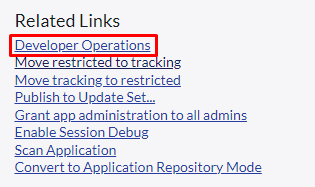
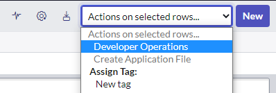
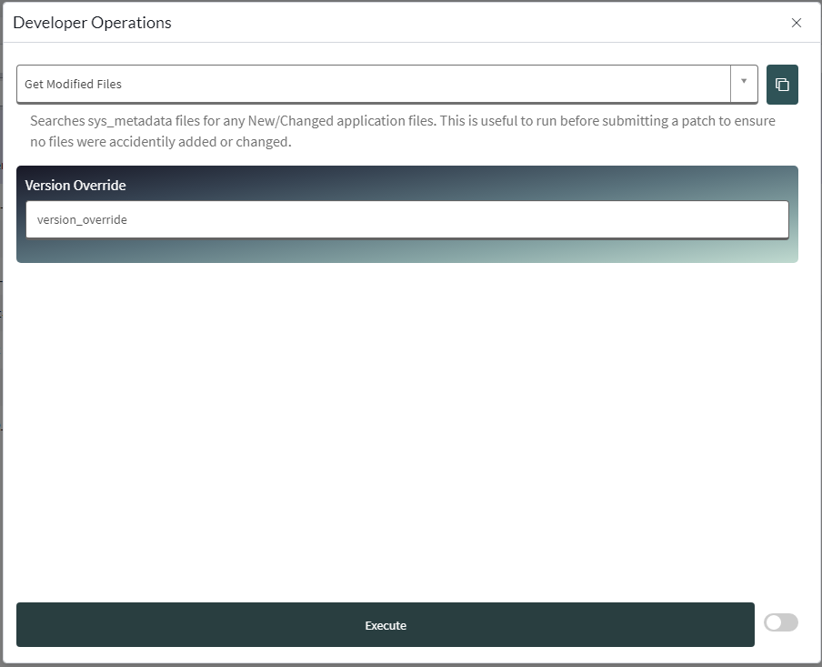

# Developer-Operations

  

### A globally scoped custom ServiceNow application Modal UI with embedded widget to execute custom background scripts with inputs and outputs.

  

I built this little tool as an easier way to execute background scripts without having to go digging around in my scripts folder and then pasting it into a code editor. Modifying the inputs and finally running it in a background script.

  

With this you can do the following:

- Create an operation of your own.

- Execute operations on one or many records.

- Execute operations in a background processor.

- Copy the script directly from form.

- Generate and return a csv file from your operation.

  

## How to get

You can either fork this branch to import it to your instance or just download the update set here. [DeveloperOperationsUpdateSet(11-11-2022.xml)](DeveloperOperationsUpdateSet%2811-11-2022%29.xml)

## Execute an operation
Executing an operation is extremely simple. As long as you are in the base platform UI (either a form or a list view) you can access the developer operations through the UI action.

  					

This opens up the Developer Operations model which embededs a ServicePortal widget.

Form Elements

 1. A drop down with all available operations that can be executed on the selected record(s).
  
 2. A copy button which will dynamicly generate a script into your clipboard if you want to execute this logic outside of your current ServiceNow instance.
 3. Variable inputs based on which operation you have selected.
 4. A toggle to optionally execute the operation in a background processor (mostly usefull for longer running operations).
 5. And obviously, the execute button.

